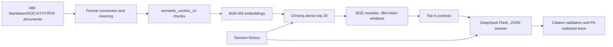

# AIA RAG Case Study

A bilingual, multi-format retrieval-augmented QA service over 488 MultiDoc2Dial-derived government-service documents. The corpus stands in for the “internal knowledge base” in [require.md](require.md). The repository includes the complete source corpus, a CLI, JSON HTTP API, isolated multi-turn sessions, citations, refusal behavior, PII-redacted traces, a frozen evaluation protocol, and failure-preserving results.

The final holdout meets Faithfulness (0.918 ≥ 0.85) and warm latency (98/100 ≤ 10s) targets. Automated correctness (57–67%) and Context Precision (0.662) remain below their ≥80%/≥0.70 targets — the project presents those gaps and the optimization path as part of the case study. Full metric table, denominators, sensitivity results, and costs are in [EVALUATION_SUMMARY.md](doc/EVALUATION_SUMMARY.md).

The 380-word [DESIGN_NOTE.md](doc/DESIGN_NOTE.md) explains the architecture and trade-offs. [sample_logs.jsonl](doc/sample_logs.jsonl) contains five PII-redacted examples.

## Architecture



The frozen artifact folder is `data/experiments/eval_v12/delivery_candidate/semantic_1024_v2`. It contains 1,591 chunks, a verified BGE-M3 embedding array and manifest, with Chroma created locally on first startup. The embedding revision is `5617a9f61b028005a4858fdac845db406aefb181`.

## Requirements

- macOS or Linux with Python 3.11 or 3.12
- [`uv`](https://docs.astral.sh/uv/) for the locked environment
- about 5–6 GB free for the Python environment, approximately 3.43 GB of pinned BGE model files, and local artifacts
- a DeepSeek API key for live generation
- Tesseract with English and Simplified Chinese data only when rebuilding scanned-document conversions

Install the locked dependencies:

```bash
uv sync --frozen
```

The source corpus, frozen cleaned text, chunks and verified passage embeddings are checked into this repository. Chroma is a derived local database: the first service startup creates it from the verified vectors. It is excluded from Git.

Download the exact embedding/reranker model files once; this does not use a DeepSeek key or call a generation API:

```bash
uv run python -m src.setup_models
export TIKTOKEN_CACHE_DIR=data/experiments/tokenizer_cache
```

Use `uv run python -m src.setup_models --offline` to verify an existing model cache. Tests and corpus/result verification do not require model weights or an API key.

Create a local secret file that is excluded by `.gitignore`:

```bash
cp .env.example .env.local
# Edit .env.local locally and replace the placeholder.
chmod 600 .env.local
```

`.env.local` stays local and is excluded from Git.

## Run the CLI demo

Verify the corpus, release, vectors and the measured execution-code hashes without provider calls:

```bash
uv run python -m src.verify
```

Print the final runtime configuration:

```bash
uv run python -m src.service.final_demo
```

Start the interactive, budget-capped demo:

```bash
HF_HUB_OFFLINE=1 TRANSFORMERS_OFFLINE=1 \
uv run python -m src.service.final_demo \
  --run \
  --env-file .env.local \
  --budget-rmb 2
```

Ask questions in English or Chinese. The same session carries previous user and assistant turns. Use `/reset` to rotate the session and clear history, and `/exit` to stop. Answers print document, heading, and chunk citations. The API also returns the source basename; use the document ID in `data/corpus/manifests/document_manifest.json` to locate the exact original under `data/corpus/documents/`. Logs are written under `data/logs/final_cli/` with restrictive permissions.

Useful demo prompts:

```text
How can I request a Board Appeal?
Can I reschedule its hearing?
/reset
我想申请联邦学生贷款，需要先做什么？
What is my current Social Security application status?
```

The last prompt demonstrates the personal/live-status boundary: the service can offer static guidance but cannot read a user account.

## Run the HTTP API

The server binds to localhost by default and uses the same runtime as the CLI and evaluation:

```bash
HF_HUB_OFFLINE=1 TRANSFORMERS_OFFLINE=1 \
uv run python -m src.service.http_api \
  --env-file .env.local \
  --budget-rmb 2 \
  --host 127.0.0.1 \
  --port 8080
```

Health:

```bash
curl -s http://127.0.0.1:8080/health
```

First question:

```bash
curl -s http://127.0.0.1:8080/ask \
  -H 'Content-Type: application/json' \
  -d '{"question":"How can I request a Board Appeal?"}'
```

The response contains `session_id`, `request_id`, `status`, `answer`, `action`, `citations`, `error_type`, and stage-inclusive `latency_ms`. Send the returned `session_id` with the next turn:

```bash
curl -s http://127.0.0.1:8080/ask \
  -H 'Content-Type: application/json' \
  -d '{"question":"Can I reschedule its hearing?","session_id":"SESSION_ID"}'
```

Reset a session:

```bash
curl -s http://127.0.0.1:8080/sessions/reset \
  -H 'Content-Type: application/json' \
  -d '{"session_id":"SESSION_ID"}'
```

The API rejects unknown sessions, invalid JSON, unsupported fields, empty questions, oversized requests, excessive history, and invalid roles. Facts require valid retrieved citation IDs. Citation-ID validation prevents invented identifiers; Faithfulness evaluation checks semantic support separately.

## Test

The current repository has one self-contained suite: **69 tests**. It covers corpus/release integrity, Unicode and heading preservation, cache invalidation, real Chroma payload checks, the budgeted transport, RAGAS aggregation, preserved failure denominators, session isolation, citation validation, PII persistence, and the HTTP contract.

```bash
TIKTOKEN_CACHE_DIR=data/experiments/tokenizer_cache \
HF_HUB_OFFLINE=1 TRANSFORMERS_OFFLINE=1 \
uv run python -m unittest discover -s tests
```

The tests use temporary state and mocked provider calls. HTTP tests open a random localhost port. A GitHub Actions workflow runs this suite and the offline integrity checks on pushes and pull requests; its remote run is not part of the local verification record.

## Corpus and index reconstruction

All input data is now in [data/corpus/](data/corpus/README.md). There is no dependency on a developer Desktop directory. Only its `documents/` tree enters retrieval; full source test records stay separate from the frozen 100-dev/100-holdout evaluation. [Data layout](data/README.md) explains every retained data tree.

For a deterministic reconstruction, use the checked-in 488 cleaned documents. The builder verifies original source hashes, rebuilds chunks, and reuses frozen vectors only if the rebuilt chunk file is byte-identical:

```bash
TIKTOKEN_CACHE_DIR=data/experiments/tokenizer_cache \
uv run python -m src.build_index --out data/local/rebuild
```

The output is `data/local/rebuild/semantic_1024_v2`, reproducing the final 1,591 chunks and their SHA-256. Add `--reconvert` to parse every original file again from scratch (needs Tesseract with `eng`+`chi_sim` language data). See [VALIDATION.md](doc/VALIDATION.md) for the full reconstruction/verification record — byte-identical reproduction proof, the dev-only retrieval-comparison rerun, and OCR-determinism caveats.

## Evaluation artifacts and reproducibility

The final machine-readable result is:

```text
data/experiments/eval_v12/final_holdout_20260907/analysis.json
```

Recompute only its aggregation, without provider calls:

```bash
uv run python -m src.evaluation.analyze_final \
  --root data/experiments/eval_v12/final_holdout_20260907 \
  --check
```

Do not re-run or tune on the holdout. Its plan and configuration bindings were frozen before the one-time run. Development work belongs on a new release and requires a new untouched final sample.

See [doc/README.md](doc/README.md) for the full documentation index (evaluation summary, project history, frozen release manifests, demo script, sample logs), and [data/experiments/README.md](data/experiments/README.md) for the retained machine-readable plans, outputs, and usage ledgers.

The earlier 91-document corpus, obsolete experiment runners/tests, duplicated conversion outputs, raw API caches and delivery ZIPs have been removed. Historical conclusions remain in `doc/PROJECT_SUMMARY.md`; retained reports are explicitly marked as historical. Their commands and full-run inventories may refer to removed development artifacts. Current run and reconstruction commands are the ones in this README.

Some implementation filenames retain `v1`/`v11` names because the final runtime and judge still depend on those exact versions; they are checked against the measured code hashes. The old semantic chunker is kept solely for the before/after regression.

## Repository layout

```text
src/                 final service, ingestion, retrieval, scoring and verification
tests/               current self-contained regression suite
data/corpus/         all original transformed documents, manifests and source tests
data/experiments/    frozen artifacts and selected optimization evidence
doc/                 design, evaluation, demo and development record
.github/workflows/   local regression workflow
```

This repository is the submission. No separate delivery package is required. Local secrets, downloaded models, Chroma databases, runtime API caches and scratch rebuilds are excluded from Git. Original raw dataset bytes and frozen artifacts are protected from Git line-ending conversion.

## Security and privacy boundary

Retrieved excerpts and prior messages are framed as untrusted data in the system prompt. The runtime validates structured output and exact citation IDs, refuses low-confidence retrieval, and refuses personal/live account lookup. Final checks covered prompt extraction, fake authority, instruction priority, persona hijacking, English/Chinese continuity, correction, topic switching, and session isolation.

PII redaction happens when traces are written. The provider still receives the original question and history. A deployment handling sensitive data needs an approved provider/data-processing arrangement or an outbound redaction/tokenization layer. The current controls are a minimum case-study defense, not a comprehensive security boundary.
